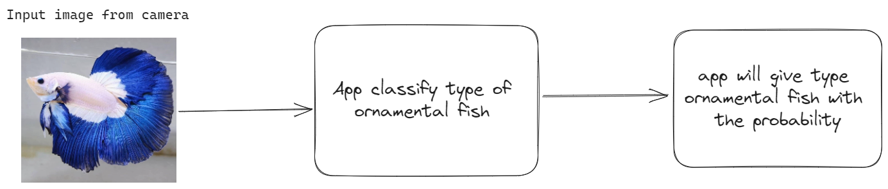

## Dataset
Untuk akses dataset dapat melalui link Berikut:

Dataset di dapat melalui scrapping 90% dan melalui Platform Kaggle

## Task
The objective is to create a system capable of recognizing diverse ornamental fish species by analyzing input images or related characteristics. Achieving this goal entails training a machine learning model for the purpose of classifying these fish types.

## What ML model do in our app

