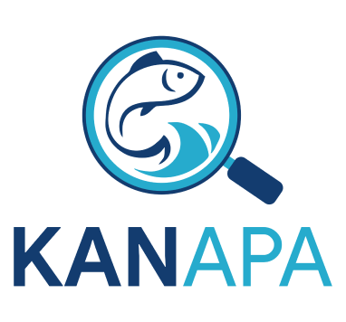

   
  <i>Your Guide to Ornamental Fish Discoveries.</i>

### About Project
As the people of Indonesia, which is an archipelagic country, not too many people know every type of fish by heart. Never mind the various kinds of fish in the sea, only ornamental fish, only a few fans and the fish hobby community know about it. Moreover, many aquarium and ornamental fish stores rarely provide a catalog of the types of fish they sell. The presence of this project answers these problems. The ornamental fish detection application, it helps ordinary people who want to buy ornamental fish to know the types of fish through camera captures and provides detailed information about these fish. Besides that, the fish type search recommendation feature can help increase sales at aquariums and ornamental fish stores.

### Our Why 
Our team made this project because they realized that many ordinary people are not familiar with various types of ornamental fish. Even though we as maritime citizens are in an archipelago with many types of fish, at least we know the types of fish starting from the ornamental fish that are easy to find in the nearest aquarium and ornamental fish store. Besides that, this type of ornamental fish detection feature can be used anywhere.

  <h3>Our Team</h3>
  <h3>Team ID: C23-PC674</h3>
  <table align="center">
    <tr>
      <th>Bangkit ID</th>
      <th>Name</th>
      <th>Learning Path</th>
      <th>Profile</th>
    </tr>
    <tr>
      <td>M335DSX2821</td>
      <td>Ario Tua Purba</td>
      <td>Machine Learning</td>
      <td>
        
        
      </td>
    </tr>
    <tr>
      <td>M166DKX3865</td>
      <td>Zaenul Muntaha</td>
      <td>Machine Learning</td>
    <td>
        
        
      </td>
    </tr>
    <tr>
      <td>M030DSY2529</td>
      <td>Rossianna Dewi Sri Hutabarat</td>
      <td>Machine Learning</td>
    <td>
        
        
      </td>
    </tr>
    <tr>
      <td>C335DSX4878</td>
      <td>Muhammad Rahmat Muhaimin</td>
      <td>Cloud Computing</td>
 <td>
        
        
      </td>
    </tr>
    <tr>
      <td>C163DSX3569</td>
      <td>Mohammad Lukman Hakim</td>
      <td>Cloud Computing</td>
   <td>
        
        
      </td>
    </tr>
    <tr>
      <td>A071DKX4027</td>
      <td>Kholan Mustaqim</td>
      <td>Mobile Development</td>
 <td>
        
        
      </td>
    </tr>
  </table>

### Demo Our App

  

## Resources
In our project is divided into four branches.

1. [main](https://github.com/maschollan/KANAPA/tree/main)
2. [android-development](https://github.com/maschollan/KANAPA/tree/MD)
3. [cloud-computing](https://github.com/maschollan/KANAPA/tree/CC)
4. [machine-learning](https://github.com/maschollan/KANAPA/tree/ML)

